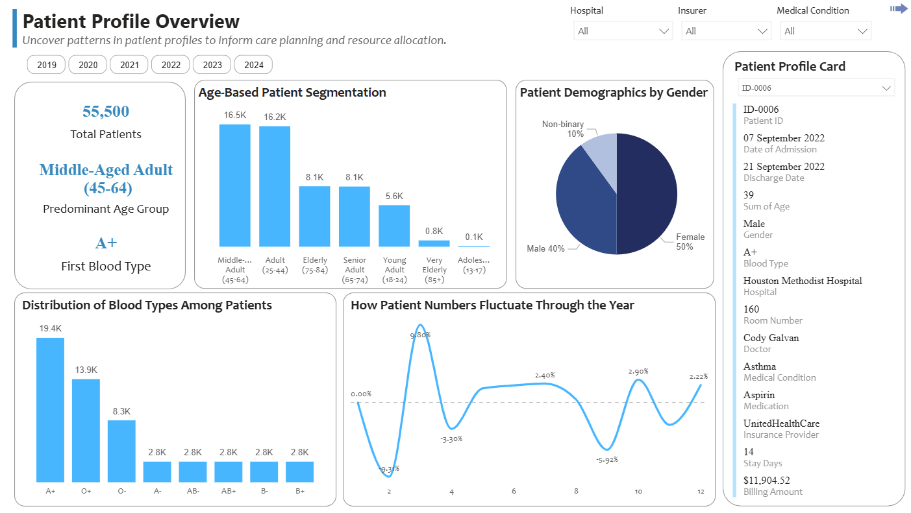
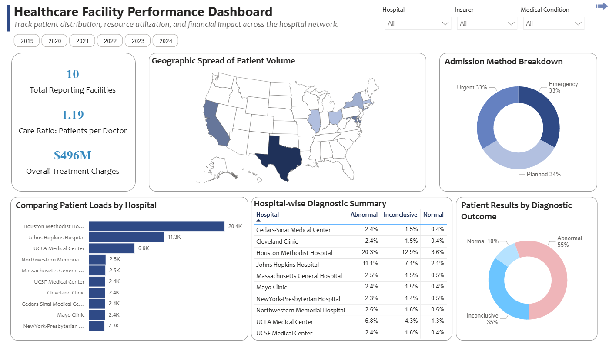
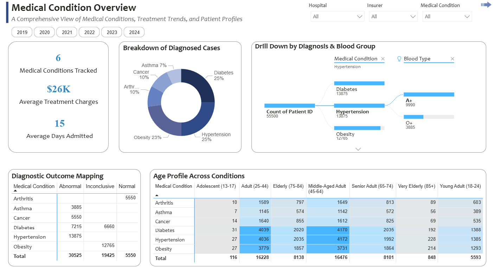
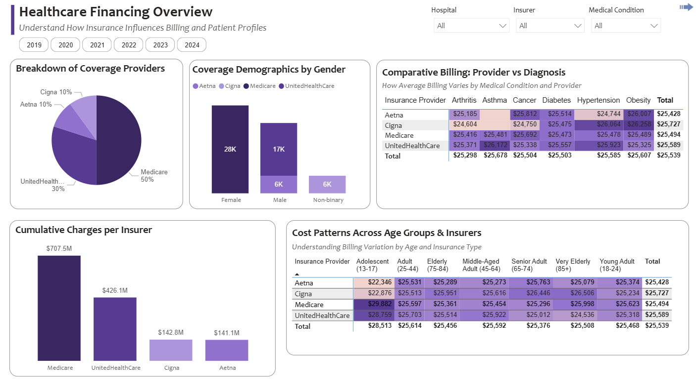

# 🩺 Healthcare Insights Dashboard | Power BI Project

Unlocking the hidden patterns in hospital admissions, diagnoses, treatments, and billing to support **better healthcare decisions, cost optimization,** and **patient outcomes**.

---

## 📌 Project Summary

This Power BI project explores a synthetic hospital dataset covering patient demographics, medical conditions, blood types, insurance providers, billing amounts, and more.

With four report pages and a highly interactive dashboard, this analysis identifies at-risk populations, patterns in diagnostic outcomes, and potential insights for hospital operations and policy improvement.

---

## 🎯 Objectives

- Understand patient distributions by age, gender, blood type, and condition
- Analyze diagnostic test outcomes and disease prevalence
- Evaluate hospital workloads and geographic health patterns
- Examine how **insurance type** and **demographics** affect billing
- Explore possible blood-type-linked disease tendencies

---

## 🔍 Key Insights

### 👥 Patient Demographics
- Middle-aged adults (45–64) form the largest age group in hospital visits
- Majority of patients are **female**, followed by **male**, with **non-binary** as a small but represented group
- Blood type **A+** is the most common

### 🏥 Hospital & Geographic Patterns
- **Texas** leads in patient concentration
- **Houston Methodist** sees the highest volume of patients
- Admission types are evenly split between **planned**, **urgent**, and **emergency**
- Balanced **patient-to-doctor ratio** of 1.19

### 🧬 Diagnostic Observations
- **55% of test results are abnormal**, suggesting high case complexity
- **Diabetes, hypertension, and obesity** are the top conditions
- Diagnostic trends show condition-specific variations in test outcomes

### 💉 Blood Type and Disease Link
> ⚠️ Exploratory Finding (requires validation)

| Condition   | Found In Blood Types                  |
|-------------|----------------------------------------|
| Diabetes    | O+, B+, A-                             |
| Hypertension| A+, O+                                 |
| Obesity     | AB-, AB+, B-, O-, A-                   |
| Arthritis   | O-                                     |
| Cancer      | A+                                     |
| Asthma      | A+                                     |

### 🏦 Insurance & Billing
- **Medicare covers only female patients**
- **Cigna** insures all non-binary patients
- **Adolescents** incur highest average treatment costs
- Billing patterns vary by condition and provider

---

## 📊 Tools Used

- [Power BI](https://powerbi.microsoft.com/)

---

## 🗃️ Data Overview

All analyses are driven by a single, comprehensive dataset containing patient-level records. Below is the data dictionary for the file `healthcare_dataset.xlsx` (or `.csv`):

| Field                | Description                                                                                          |
|----------------------|------------------------------------------------------------------------------------------------------|
| **Patient ID**       | Unique identifier for each patient                                                                  |
| **Age**              | Age of the patient (in years)                                                                        |
| **Gender**           | Gender of the patient (e.g., Male, Female, Non-binary)                                               |
| **Blood Type**       | Blood group of the patient (e.g., A+, B−, O+)                                                        |
| **Medical Condition**| Primary medical condition diagnosed                                                                  |
| **Date of Admission**| Date when the patient was admitted to the hospital                                                   |
| **Discharge Date**   | Date when the patient was discharged from the hospital                                               |
| **Doctor**           | Responsible doctor during the stay (not necessarily a specialist)                                    |
| **Hospital**         | Name of the hospital where the patient received treatment                                            |
| **Hospital Latitude**| Geographical latitude of the hospital                                                                |
| **Hospital Longitude**| Geographical longitude of the hospital                                                              |
| **Admission Type**   | Type of admission (e.g., Elective, Emergency, Urgent)                                                |
| **Room Number**      | Room number assigned to the patient during hospital stay                                             |
| **Medication**       | General medication prescribed during treatment (may not be specific to the diagnosed condition)     |
| **Test Results**     | Outcome of medical tests (e.g., Normal, Abnormal, Inconclusive)                                      |
| **Insurance Provider**| Name of the patient’s insurance company                                                             |
| **Billing Amount**   | Total billing amount for the treatment (in USD)                                                      |

---

## 📸 Report Pages Overview

Your Power BI report includes the following four detailed analysis pages:

| Report Page               | Description |
|---------------------------|-------------|
| **Patient Profile**       | Demographic analysis by age, gender, and blood type. Includes patient trends over time. |
| **Hospital Overview**     | Patient volume by hospital and state, diagnostic result summary, geographic trends, and admission methods. |
| **Medical Condition Overview** | Breakdown of medical diagnoses across age groups and blood types. Insights into test results and condition severity. |
| **Insurance & Billing**   | Insurance provider coverage by gender, average billing amounts by condition and provider, and cost variation across age groups. |

---

## 🏅 Highlights

- 🧠 Designed a multi-layered analytical dashboard using **real-world healthcare structure**
- 📊 Delivered **4 interactive report pages** in Power BI
- 🎖️ Demonstrated insights in patient profiles, diagnostics, and hospital-level performance

---

### 🔍 Visual Snapshots

| Patient Profile | Hospital Overview |
|-----------------|-------------------|
|  |  |

| Medical Conditions | Insurance & Billing |
|--------------------|----------------------|
|  |  |

